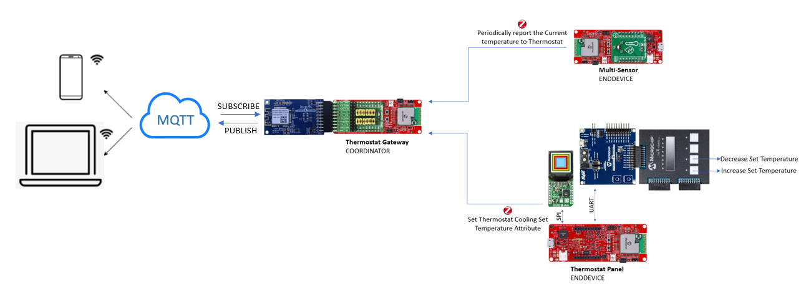

# PIC32CXBZ2_WBZ45x SMART INDUSTRIAL THERMOSTAT

> "IoT Made Easy!"
Devices: **| PIC32CXBZ2 | WBZ45x |** 
Features: **| ZIGBEE | Wi-Fi |**

## ⚠ Disclaimer

<b>
THE SOFTWARE ARE PROVIDED "AS IS" AND GIVE A PATH FOR SELF-SUPPORT AND SELF-MAINTENANCE. This repository contains example code intended to help accelerate client product development.  

For additional Microchip repos, see: <a href="https://github.com/Microchip-MPLAB-Harmony" target="_blank">https://github.com/Microchip-MPLAB-Harmony</a>

Checkout the <a href="https://microchipsupport.force.com/s/" target="_blank">Technical support portal</a> to access our knowledge base, community forums or submit support ticket requests.

</b>

## Introduction

A Smart Thermostat is a device which can control the temperature and maintain a comfort environment by adjusting the heating or cooling system to a preferred set point. This demo consists of 3 modules: a thermostat sensor, thermostat panel and a thermostat gateway. A thermostat sensor is an end device which reports the current temperature to the devices in the ZigBee network and it can also be made as an battery operated device. The thermostat panel is an end device which acts as the remote control to set the temperature. It can also be a battery operated device and can be kept anywhere in the room. A thermostat gateway is a Zigbee coordinator which creates a centralized network to which all the end devices join and report the current and the set temperature. This data is used for HVAC control and the same is published onto MQTT using WINC1500 in the ZigBee Gateway.

## Description

"IoT Made Easy!" - Smart Thermostat solution using Zigbee 3.0 and Wi-Fi. The Smart Thermostat enables us to set the temperature using a Thermostat Panel and get the current temperature through multisensor. Based on the current and set temperature the air conditioner is switched ON/OFF which is indicated by the RGB led in the Zigbee Gateway device. 

The above video shows the working of the Smart thermostat application. The Smart Thermostat setup includes a Zigbee Gateway, Thermostat Panel and a Multisensor. The Gateway application is a Zigbee coordinator and establishes a centralized network. The Thermostat panel and Multisensor joins this centralized network. Once the network is formed the Multisensor reports the temperature values to the devices in the network and the set temperature is reported by the Thermostat Panel. When the current temperature is higher than the set temperature the air conditioner is switched ON and simultaneously the RGB led in the Zigbee Gateway device is also switched ON and vice versa.

## Contents

1. [Thermostat Gateway](https://github.com/MicrochipTech/PIC32CXBZ2_WBZ45x_WINC1500_Zigbee_Wi-Fi_Smart_Thermostat/tree/main/Thermostat_Zigbee_Gateway)

2. [Thermostat Panel](https://github.com/MicrochipTech/PIC32CXBZ2_WBZ45x_WINC1500_Zigbee_Wi-Fi_Smart_Thermostat/tree/main/Thermostat_Zigbee_Panel)

3. [Thermostat Sensor](https://github.com/MicrochipTech/PIC32CXBZ2_WBZ45x_ZIGBEE_MULTISENSOR_TEMPHUM13_CLICK)

