# PIC32CXBZ2_WBZ45x_WINC1500_ZIGBEE_GATEWAY


> "IOT Made Easy!"
Devices: **| PIC32CXBZ2 | WBZ45x |**<br>
Features: **| ZIGBEE | Wi-Fi |**

[Back to Main page](https://github.com/MicrochipTech/PIC32CXBZ2_WBZ45x_WINC1500_Zigbee_Wi-Fi_Smart_Thermostat)

## ⚠ Disclaimer

<p><span style="color:red"><b>
THE SOFTWARE ARE PROVIDED "AS IS" AND GIVE A PATH FOR SELF-SUPPORT AND SELF-MAINTENANCE. This repository contains example code intended to help accelerate client product development. </br>

For additional Microchip repos, see: <a href="https://github.com/Microchip-MPLAB-Harmony" target="_blank">https://github.com/Microchip-MPLAB-Harmony</a>

Checkout the <a href="https://microchipsupport.force.com/s/" target="_blank">Technical support portal</a> to access our knowledge base, community forums or submit support ticket requests.
</span></p></b>

## Contents

1. [Introduction](#step1)
1. [Bill of materials](#step2)
1. [Hardware Setup](#step3)
1. [Software Setup](#step4)
1. [Harmony MCC Configuration](#step5)
1. [Board Programming](#step6)
1. [Run the demo](#step7)

## 1. Introduction<a name="step1">

This example application demonstrates the use of the ATWINC15x0 with the WBZ451 Curiosity board to create a Zigbee Thermostat Gateway application. A Zigbee gateway application is used to transfer data among devices in a Zigbee network. Here we use Winc1500 to publish the same data onto MQTT explorer so that a user can subscribe and access the data.

## 2. Bill of materials<a name="step2">

|**Tools**|**Quantity**|
| :- | :- |
|[WBZ451 Curiosity Evaluation Kit](https://www.microchip.com/DevelopmentTools/ProductDetails/PartNO/EA71C53A)|1|
|[WINC1500 Xplained Pro](https://www.microchip.com/en-us/product/ATWINC1500)|1|
|[XPRO-ADAPTER  Click](https://www.mikroe.com/xpro-adapter-click)|1|

## 3. Hardware Setup<a name="step3">

- Connect the WBZ451 Curiosity Evaluation Kit to the Host PC as a USB Device through a Type-A male to micro-B USB cable connected to Micro-B USB (Debug USB) port
- Connect WINC1500 Xplained Pro and WBZ451 Curiosity board as below

|WBZ451 Click Connector|WBZ451 Pin Name/Number|WINC1500 Xplained Pro|WINC1500 Pin Name/Number|
| :- | :- | :- | :- |
|1|PB1|10|CHIP EN|
|2|PB2|5|RST|
|3|PA9|15|SPI CS|
|4|PA8|18|SPI CLK|
|5|PA10|17|SPI\_MISO|
|6|PA7|16|SPI\_MOSI|
|7|Vcc|20|+3.3V|
|8|GND|19|GND|
|15/16|PA2|9|IRQN (In V2 board, connect to 16)|

- WBZ451 Curiosity board can be connected to WINC1500 Xplained Pro using a [XPRO-ADAPTER  Click](https://www.mikroe.com/xpro-adapter-click) as depicted below.

  - The jumper settings in XPRO-ADAPTER click board is as shown above figure. Use Jumpers and Jumper wires to connect the header as mentioned in below table.

	|Jumper Connections|
	| :- |
	|J3.1 &emsp; to &emsp; J4.1 |
	|J3.3 &emsp; to &emsp; J1.5 |
	|J3.5 &emsp; to &emsp; J3.6 |
	|J3.7 &emsp; to &emsp; J3.8 |
	|J3.9 &emsp; to &emsp; J3.10|
	|J3.11&emsp; to &emsp; J3.12|
	|J4.1 &emsp; to &emsp; J3.1 |
	|J4.3 &emsp; to &emsp; J4.4 |
	|J4.6 &emsp; Open |
	|J4.8 &emsp; Open |
	|J4.10&emsp; Open |
	|J4.12&emsp; Open |


## 4. Software Setup<a name="step4">

This project has been verified to work with the following versions of software tools:

- MPLAB X IDE v6.05 
- XC32 Compiler v4.10
- MPLAB® Code Configurator v5.2.1
- PIC32CX-BZ\_DFP v1.0.107
- MCC Harmony
  - csp version: v3.14.0
  - core version: v3.11.1
  - wireless_pic32cxbz_wbz: v1.1.0
  - dev_packs: v3.14.0
  - wireless_system_pic32cxbz_wbz: v1.1.0
  - CMSIS-FreeRTOS version: v10.4.6
  - wireless_wifi: v3.7.0
  - wireless_zigbee: v5.0.0
  - crypto: v3.7.6
  - wolfssl: v4.7.0

Refer Project Manifest present in harmony-manifest-success.yml under the project folder *firmware\src\config\default\harmony-manifest-success.yml* for more details

- Any Serial Terminal application like Tera Term terminal application.
	- configure the serial settings as follows:
		- Baud : 115200
		- Data : 8 Bits
		- Parity : None
		- Stop : 1 Bit
		- Flow Control : None

|Note|Because Microchip regularly update tools, occasionally issue(s) could be discovered while using the newer versions of the tools. If the project doesn’t seem to work and version incompatibility is suspected, It is recommended to double-check and use the same versions that the project was tested with. To download original version of MPLAB Harmony v3 packages, refer to document [How to Use the MPLAB Harmony v3 Project Manifest Feature](https://microchip.com/DS90003305)|
|:-|:-|

- [MQTT EXPLORER 0.4.0 BETA](http://mqtt-explorer.com/)

## 5. Harmony MCC Configuration<a name="step5">

| Tip | New users of MPLAB Code Configurator are recommended to go through the [overview](https://onlineDocs.microchip.com/pr/GUID-1F7007B8-9A46-4D03-AEED-650357BA760D-en-US-6/index.html?GUID-B5D058F5-1D0B-4720-8649-ACE5C0EEE2C0) |
| :- | :- |

**Step 1** - Connect the WBZ451 CURIOSITY BOARD to the device/system using a micro-USB cable.

**Step 2** - Create a new MCC Harmony project.

**Step 3** - The "MCC - Harmony Project Graph" below depicts the harmony components utilized in this project.

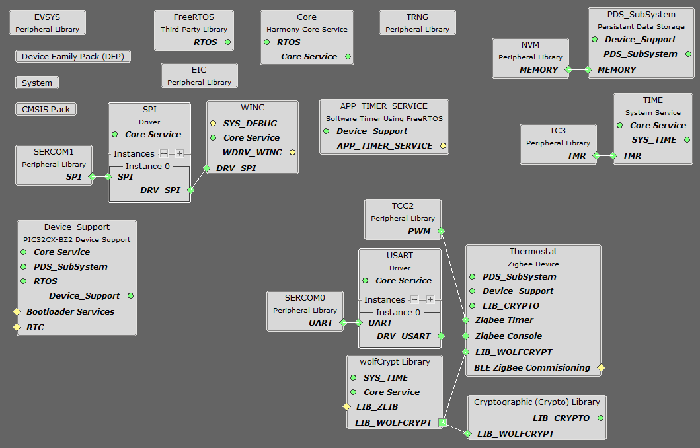

- From Device resources, go to Harmony->Wireless->Drivers and select WINC. Accept Dependencies or satisfiers, select "Yes". Right click on the "⬦" in WINC device and add SPI driver. And in the same way add SERCOM1 to the SPI driver as shown below.
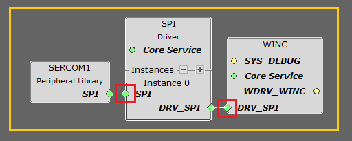

- The EIC configuration is depicted as follows.
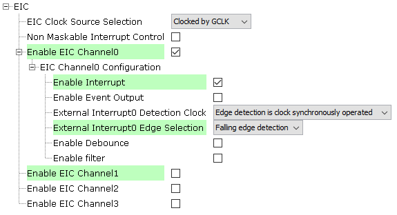

- The WINC configuration is depicted as follows.
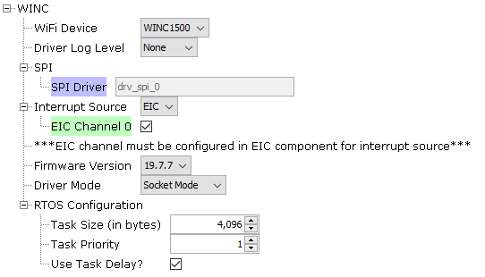

- The SPI driver configuration is depicted as follows.


- The SERCOM1 SPI configuration is depicted as follows.
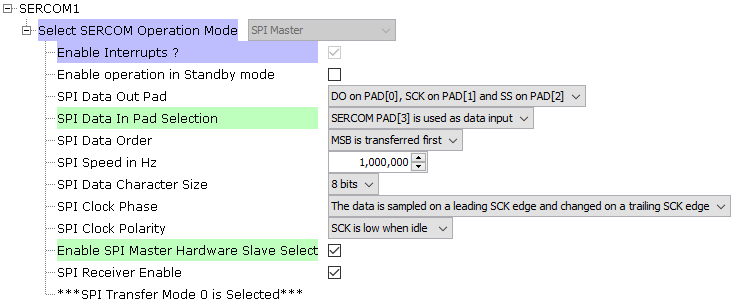

- Right click on the "⬦" in Time system service and select TC3 as shown below.
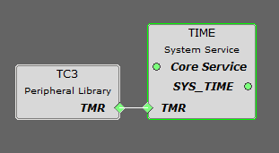

- From Device resources, go to wireless->drivers->zigbee->Device types and select THERMOSTAT. Accept Dependencies or satisfiers, select "Yes". Add UART components needed for console logs and commands. Right click on the "⬦" in Zigbee console and add the satisfier and in the same way add SERCOM0 to the USART console as shown below.
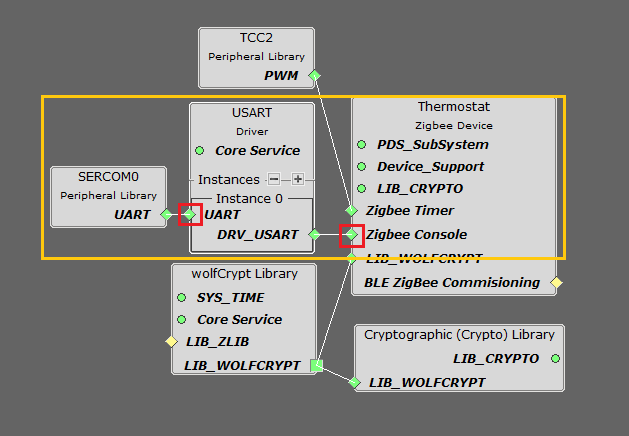

- The SERCOM0 UART configuration is depicted as follows.
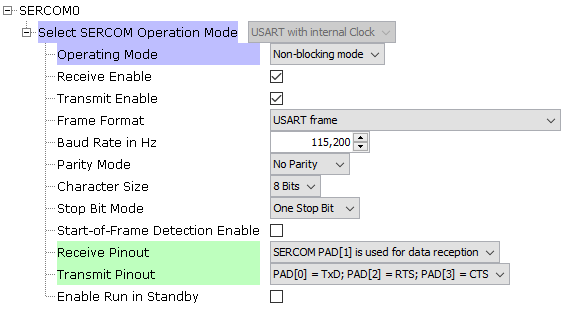

- Select Wolfcrypt library and make sure that "Support random number generation" box is unchecked as shown below.


- From Device resources, go to Harmony->Wireless->System Services and select "APP_TIMER_SERVICE".

- The SYSTEM configuration is depicted as follows.
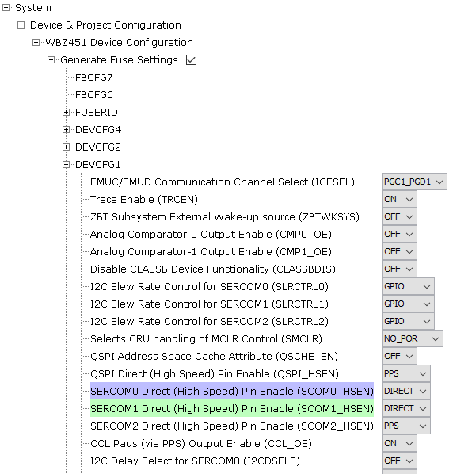

- From project graph, go to Plugins->PIN configuration and configure as follows.
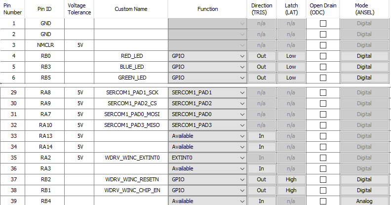

**Step 4** - [Generate](https://onlineDocs.microchip.com/pr/GUID-A5330D3A-9F51-4A26-B71D-8503A493DF9C-en-US-1/index.html?GUID-9C28F407-4879-4174-9963-2CF34161398E) the code.
 
**Step 5** - In "app_user_edits.c", make sure the below code line is commented 

- "#error User action required - manually edit files as described here".

**Step 6** - Copy the mentioned files from this repository by navigating to the location mentioned below and paste it your project folder. 

| Note | This application repository should be cloned/downloaded to perform the following steps. |
| :- | :- |
| Path | The application folder can be found in the following [link](https://github.com/MicrochipTech/PIC32CXBZ2_WBZ45x_WINC1500_Zigbee_Wi-Fi_Smart_Thermostat/tree/main/Thermostat_Zigbee_Gateway/firmware) |

- Copy the "app_winc" folder, which can be found by navigating to the following [path](https://github.com/MicrochipTech/PIC32CXBZ2_WBZ45x_WINC1500_Zigbee_Wi-Fi_Smart_Thermostat/tree/main/Thermostat_Zigbee_Gateway/firmware).
- Paste the folder under source files in your project folder (...\firmware\src).
- Copy the "paho.mqtt.embedded-c" folder, which can be found by navigating to the following path: "...\firmware\src\third_party"
- Paste the folder under the given path in your project folder (...\firmware\src\third_party).
- Copy the "wdrv_winc_debug.h" file, which can be found by navigating to the following path: "...\firmware\src\config\default\driver\winc\include\"
- Replace the file under the given path in your project folder (...\firmware\src\config\default\driver\winc\include\).

**Step 7** - Add the files in MPLAB X IDE to your project by following the steps mentioned below.

- In Projects section, right click on Source files to add the ".c" file and Header files to add the ".h" file.
- Select "Add existing items from folder".
- Select Add and browse the location of "app_winc" and "paho.mqtt.embedded-c" folder (...\firmware\src). 
- Make sure the "Files of type" is "C Source files" while adding ".c" files and "Header files" while adding ".h" files.
- Select the folder and click "add".

**Step 8** - Replace the app.c, app_timer.c and app.h file.

- Copy the "app.c" and "app.h" files by navigating to the following path: "PIC32CXBZ2_WBZ45x_ZIGBEE_MULTISENSOR_TEMPHUM13_CLICK\Zigbee_Multisensor_temphum\firmware\src\"
- Paste the files under source files in your project folder (...\firmware\src).
- Copy the "app_timer.c" file by navigating to the following path: - "...\firmware\src\app_timer"
- Paste the files under source files in your project folder (...\firmware\src\app_timer).

**Step 9** - Change the following Code as givien below.

- In "app_zigbee_handler.c" file, replace the following code lines as shown below.

```
case CMD_ZCL_REPORTING_TEMPERATURE_MEASUREMENT:
        {
            /* Command ZCL Thermostat Report Indication */
            //Access - > event.eventData.zclEventData.addressing;
            //Access - > event.eventData.zclEventData.payloadLength;
            //Access - > event.eventData.zclEventData.payload;              
            ZCL_Report_t *rep = (ZCL_Report_t *)event.eventData.zclEventData.payload;
            int16_t reportValue;
            memcpy(&reportValue, &rep->value[0], sizeof(int16_t));
            appSnprintf( "<-Temperature Measurement Value = %d\r\n", reportValue);
            thermostatUpdateServerAttributes(reportValue);
        }
```

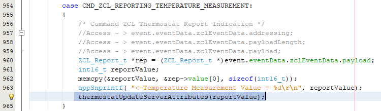

- In your MPLAB Harmony v3 based application go to "firmware\src\config\default\peripheral\sercom\spi_master\plib_sercom1_spi_master.c" and do the following changes.
  
  - At Line 177 include the following code to setup the clock frequency.
  
```
	if (setup->clockFrequency == 0)
		{
			baudValue = SERCOM1_SPIM_BAUD_VALUE;
		}
		else
		{
			baudValue = (spiSourceClock/(2U*(setup->clockFrequency))) - 1U;
		}
```	

**Step 10** - Right click on your project in the Projects section in MPLAB and select Properties. Select "xc32-gcc" and in Option categories select "Preprocessing and messages" and click on the settings option as shown below.\
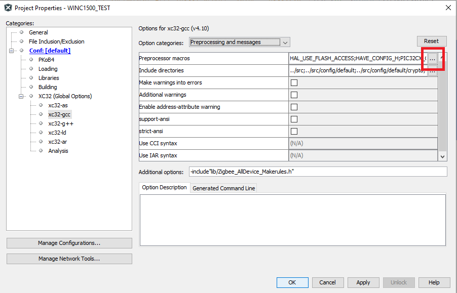

- In "Enter the string here", add "WINC_MQTT" give "ok" and "apply".

**Step 11** - To enable in printf in your project, go to Source files->config->default->stdio->xc32_monitor.c and replace with the following code.

```
#include <stddef.h>
#include "definitions.h"

extern int read(int handle, void *buffer, unsigned int len);
extern int write(int handle, void * buffer, size_t count);

int read(int handle, void *buffer, unsigned int len)
{
    int nChars = 0;
    bool success = false;
    (void)len;
    if ((handle == 0)  && (len > 0))
    {
        do
        {
            success = SERCOM0_USART_Read(buffer, 1);
        }while( !success);
        nChars = 1;
    }
    return nChars;
}

int write(int handle, void * buffer, size_t count)
{
   bool success = false;
   if (handle == 1)
   {
       do
       {
           success = SERCOM0_USART_Write(buffer, count);
       }while( !success);
   }
   return count;
}
```

**Step 12** - Clean and build the project. To run the project, select "Make and program device" button.

## 6. Board Programming<a name="step6">

### Program the precompiled hex file using MPLAB X IPE

The application hex file can be found by navigating to the following path: 
- "PIC32CXBZ2_WBZ45x_WINC1500_Zigbee_Wi-Fi_Smart_Thermostat/Thermostat_Zigbee_Gateway/Hex/"

Follow the steps provided in the link to [program the precompiled hex file](https://microchipdeveloper.com/ipe:programming-device) using MPLABX IPE to program the pre-compiled hex image. 

### Build and program the application using MPLAB X IDE

The application folder can be found by navigating to the following path: 
- "PIC32CXBZ2_WBZ45x_WINC1500_Zigbee_Wi-Fi_Smart_Thermostat/Thermostat_Zigbee_Gateway/firmware"

Follow the steps provided in the link to [Build and program the application](https://github.com/Microchip-MPLAB-Harmony/wireless_apps_pic32cxbz2_wbz45/tree/master/apps/ble/advanced_applications/ble_sensor#build-and-program-the-application-guid-3d55fb8a-5995-439d-bcd6-deae7e8e78ad-section).

## 7. Run the demo<a name="step6">

- Make sure the WINC1500 firmware is v19.7.6 or higher. Please refer to the documentation in the [WBZ451 serial bridge project](../01_wbz45x_winc1500_serialBridge/README.md#step1) to update the WINC1500 firmware.
- Open the Tera Term terminal application on your PC (from the Windows® Start menu by pressing the Start button)
- Choose USB Serial Com Port and Set the baud rate to 115200
- To connect to Wi-Fi
		- SSID: MicrochipDemoAp
		- Password: 12345678
		- To change the SSID and Password , update the WLAN_SSID and WLAN_PSK in "app_winc.c" file.

- Follow the steps mentioned below to see the data published in the MQTT.

	- Open MQTT explorer and give the host name as "broker.hivemq.com".
	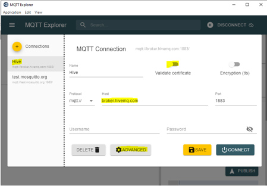
		
	- Select Advanced and add a new topic as "MCHP/WSG/THERMOSTAT_GATEWAY".
	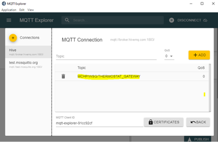
		
	- The data will be published onto MQTT as shown below.
	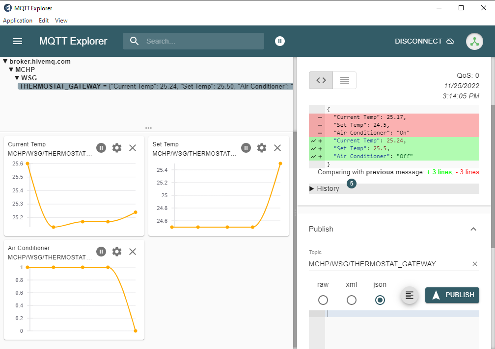
		
- Press the switch Reset on the WBZ451 Curiosity Evaluation Kit to print the console logs.
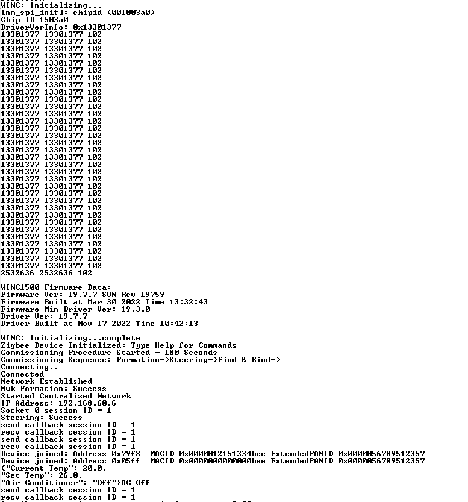

<a href="#top">Back to top</a>

