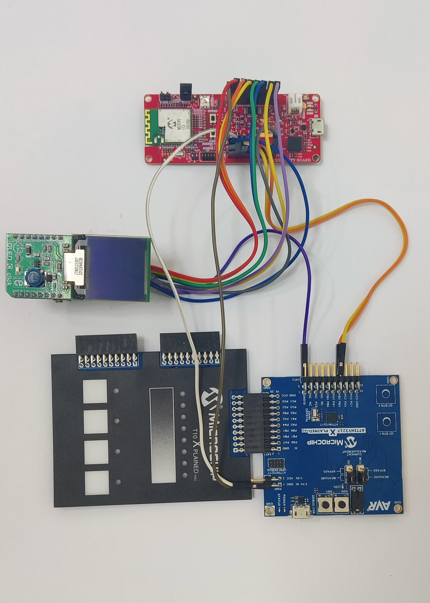
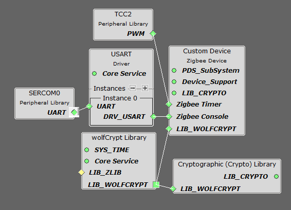
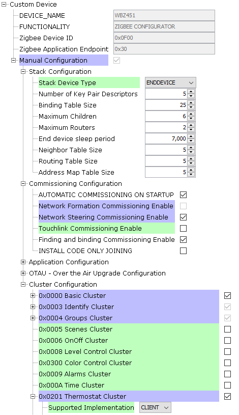
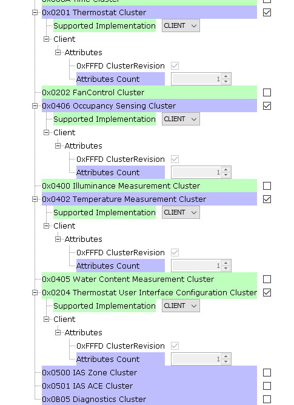
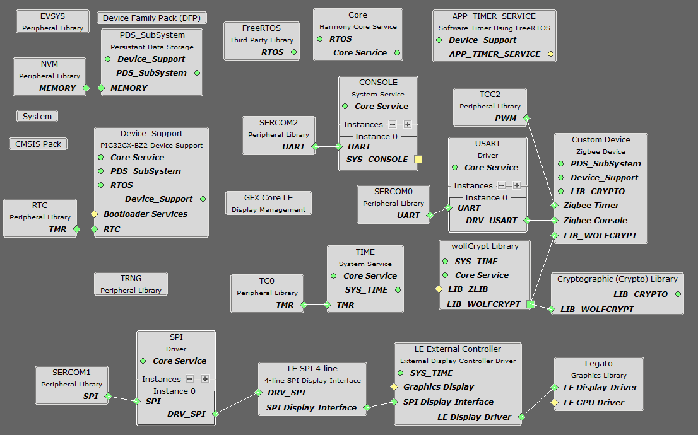

# PIC32CXBZ2_WBZ45x_ZIGBEE_PANEL

> "IOT Made Easy!" 

Devices: **| PIC32CXBZ2 | WBZ45x |** 
Features: **| ZIGBEE | OLED | TOUCH |**

[Back to Main page](https://github.com/MicrochipTech/PIC32CXBZ2_WBZ45x_WINC1500_Zigbee_Wi-Fi_Smart_Thermostat)

## ⚠ Disclaimer

<b>
THE SOFTWARE ARE PROVIDED "AS IS" AND GIVE A PATH FOR SELF-SUPPORT AND SELF-MAINTENANCE. This repository contains example code intended to help accelerate client product development.  

For additional Microchip repos, see: <a href="https://github.com/Microchip-MPLAB-Harmony" target="_blank">https://github.com/Microchip-MPLAB-Harmony</a>

Checkout the <a href="https://microchipsupport.force.com/s/" target="_blank">Technical support portal</a> to access our knowledge base, community forums or submit support ticket requests.

</b>

## Contents

1. [Introduction](#step1)
1. [Bill of materials](#step2)
1. [Hardware Setup](#step3)
1. [Software Setup](#step4)
1. [Harmony MCC Configuration](#step5)
1. [Board Programming](#step6)
1. [Run the demo](#step7)

## 1. Introduction<a name="step1">

This example demonstrates the use of the OLED C CLICK and an external touch interface (ATtiny3217 Xplained Pro and T10 Xplained Pro kit) with the WBZ451 Curiosity board to create a Zigbee Panel application for Smart Thermostat. The touch interface enables us to switch on/off the display, reset the device to factory new and set the temperature. The set temperature will be reported to the Zigbee Coordinator. The current temperature reported from the coordinator and the set temperature is shown on the OLED display.

- Button1: To switch ON/OFF the display 
- Button3: To increase the set temperature
- Button4: To decrease the set temperature
- To reset the device to factory new press Button 1, 3 and 4 simultaneously.

| Tip | Go through the [overview](https://onlineDocs.microchip.com/pr/GUID-A5330D3A-9F51-4A26-B71D-8503A493DF9C-en-US-2/index.html?GUID-668A6CB2-F1FB-438D-9E1E-D67AC3C1C132) for understanding few key Zigbee 3.0 protocol concepts |
| :- | :- |

## 2. Bill of materials<a name="step2">

| TOOLS | QUANTITY |
| :- | :- |
| [PIC32CX-BZ2 and WBZ451 Curiosity Development Board](https://www.microchip.com/en-us/development-tool/EV96B94A) | 1 |
| [OLED C CLICK](https://www.mikroe.com/oled-c-click) | 1 |
| [ATtiny3217 Xplained Pro](https://www.microchip.com/en-us/development-tool/ATTINY3217-XPRO) | 1 |
| [T10 Xplained Pro Extension Kit](https://www.microchip.com/en-us/development-tool/AC47H23A) | 1 |

## 3. Hardware Setup<a name="step3">

- Connect the OLED C CLICK with the WBZ451 CURIOSITY BOARD using the below table.

|WBZ451|OLED CLICK |Description|WBZ451|OLED CLICK|Description|
| :- | :- | :- | :- |:- | :- |
|AN|15(EN)|ENABLE|PWM|16(D/C)|Data/Command|
|RST|2(RST) |RESET|INT|NC|NC|
|CS|3(CS)  |CHIP SELECT |RX|NC|NC|
|SCK|4(SCK) |SPI CLOCK|TX|NC|NC|
|MISO|5(MISO)|SERIAL DATA OUTPUT|SCL|NC|NC|
|MOSI|6(MOSI)|SERIAL DATA INPUT|SDA|NC|NC|
|3.3V|7(3.3V)|POWER SUPPLY|5V|NC|NC|
|GND|8(GND)|GROUND|GND|1(R/WC)|Read/Write|

- Connect T10 Extension header 3 (EXT3) to ATtiny3217 Xplained Pro  Extension Header 1 (EXT1).
- Connect the External 3 header of ATtiny3217 Xplained Pro touch interface with the WBZ451 Curiosity board using jumper wires as shown in the table below.

|ATtiny3217 Xplained Pro+T10 Xplained Pro|Description|WBZ451 |Description|
| :- | :- | :- | :- |
|PB3|UART-RX|PA13(SDA)|Sercom2-UART-TX|
|PB2|UART-TX|PA14(SCL)|Sercom2-UART-RX|
|5.0V IN|Power supply|5V|Power supply|
|GND|Ground|GND|Ground|

| Note: Make sure to have common GND! |
| --- |

## 4. Software Setup<a name="step4">

- [MPLAB X IDE ](https://www.microchip.com/en-us/tools-resources/develop/mplab-x-ide#tabs)

    - Version: 6.05
	- XC32 Compiler v4.10
	- MPLAB® Code Configurator v5.2.0
	- PIC32CX-BZ_DFP v1.0.107
	- MCC Harmony
	  - csp version: v3.14.1
	  - core version: v3.11.1
	  - CMSIS-FreeRTOS: v10.4.6
	  - wireless_pic32cxbz_wbz: v1.1.0
	  - wireless_system_pic32cxbz_wbz: v1.1.0
	  - dev_packs: v3.14.0
	  - gfx: v3.11.1
	  - wolfssl version: v4.7.0
	  - crypto version: v3.7.6
	  - wireless_zigbee: v5.0.0
	    
- Any Serial Terminal application like [TERA TERM](https://download.cnet.com/Tera-Term/3000-2094_4-75766675.html) terminal application

- [MPLAB X IPE v6.00](https://microchipdeveloper.com/ipe:installation)

## 5. Harmony MCC Configuration<a name="step5">

| Tip | New users of MPLAB Code Configurator are recommended to go through the [overview](https://onlineDocs.microchip.com/pr/GUID-1F7007B8-9A46-4D03-AEED-650357BA760D-en-US-6/index.html?GUID-AFAB9227-B10C-4FAE-9785-98474664B50A) |
| :- | :- |

**Step 1** - Connect the WBZ451 CURIOSITY BOARD to the device/system using a micro-USB cable.

**Step 2** - This application is built by using [ZIGBEE CI With OLED Display](https://github.com/MicrochipTech/PIC32CXBZ2_WBZ45x_ZIGBEE_CI_OLED_Display) as the building block. The project graph of the application is shown below.

| Note | The Zigbee CI with OLED application repository can be cloned/downloaded from this [link](https://github.com/MicrochipTech/PIC32CXBZ2_WBZ45x_ZIGBEE_CI_OLED_Display). |
| :- | :- |

- This aplication can also be created using Combined Interface but since we are using a battery operated device we use a Custom device. Select the Combined Interface component in the Project graph and click ❌ to remove it.

- From Device resources, go to wireless->drivers->zigbee->Device types and select CUSTOM device. Accept Dependencies or satisfiers, select "Yes". Add UART components needed for console logs and commands. Right click on the "⬦" in Zigbee console to add the satisfier and make the configurations as shown below.  \

- From Device resources, go to System services and select console. Right click on the "⬦" on the instance0 and select SERCOM2 to create a UART communication with the touch interface and the configurations are shown below.\

- From Device resources, go to Wireless->System services and select "APP_TIMER_SERVICE".

- The SYSTEM configuration is depicted as follows.\

- The PIN configuration is depicted as follows.\

- The project graph after making the changes is shown below.\

**Step 4** - [Generate](https://onlineDocs.microchip.com/pr/GUID-A5330D3A-9F51-4A26-B71D-8503A493DF9C-en-US-1/index.html?GUID-9C28F407-4879-4174-9963-2CF34161398E) the code.

- After the code gets generated a Merge window will appear. Click on the arrow and merge all the files.

**Step 5** - In "app_user_edits.c", make sure the below code line is commented 

- "#error User action required - manually edit files as described here".

**Step 8** - Replace the app.c, app_zigbee_handler.c and app.h file.

| Note | This application repository should be cloned/downloaded to perform the following steps. |
| :- | :- |
| Path | The application folder can be foung in the following [link](https://github.com/MicrochipTech/PIC32CXBZ2_WBZ45x_WINC1500_Zigbee_Wi-Fi_Smart_Thermostat/tree/main/Thermostat_Zigbee_Panel/WBZ451_ZIGBEE_THERMOSTAT_TOUCH_OLED/firmware) |

- Copy the "app.c" and "app.h" files by navigating to the following path: "WBZ451_ZIGBEE_THERMOSTAT_TOUCH_OLED/firmware/src/"
- Paste the files under source files in your project folder (...\firmware\src).
- Copy the "app_zigbee_handler.c" and "app_timer.c" files by navigating to the following paths: 
	- "WBZ451_ZIGBEE_THERMOSTAT_TOUCH_OLED/firmware/src/app_zigbee"
	- "WBZ451_ZIGBEE_THERMOSTAT_TOUCH_OLED/firmware/src/app_timer"
- Paste the files under the respecive folders in your project folder .

**Step 9** - Clean and build the project. To run the project, select "Make and program device" button.

**Step 10** - The OLED display & data are printed onto the tera term.

- Baud rate: 115200
- Com port: COM USB serial port

### Programming the ATTINY3217 XPRO with the T10 interface

- Follow the steps provided under [program the precompiled hex file](https://microchipdeveloper.com/ipe:programming-device)  section to program the ATtiny3217 Xplained Pro and T10 Xplained Pro interface.
- The application folder can be found by navigating to the following path: 
	- "PIC32CXBZ2_WBZ45x_WINC1500_Zigbee_Wi-Fi_Smart_Thermostat/Thermostat_Zigbee_Panel/Hex/ATTiny3217_T10.hex"

## 6. Board Programming<a name="step6">

### Program the precompiled hex file using MPLAB X IPE

The application hex file can be found by navigating to the following path: 
- "PIC32CXBZ2_WBZ45x_WINC1500_Zigbee_Wi-Fi_Smart_Thermostat/Thermostat_Zigbee_Panel/Hex/"

Follow the steps provided in the link to [program the precompiled hex file](https://microchipdeveloper.com/ipe:programming-device) using MPLABX IPE to program the pre-compiled hex image. 

### Build and program the application using MPLAB X IDE

The application folder can be found by navigating to the following path: 
- "PIC32CXBZ2_WBZ45x_WINC1500_Zigbee_Wi-Fi_Smart_Thermostat/Thermostat_Zigbee_Panel/"

Follow the steps provided in the link to [Build and program the application](https://github.com/Microchip-MPLAB-Harmony/wireless_apps_pic32cxbz2_wbz45/tree/master/apps/ble/advanced_applications/ble_sensor#build-and-program-the-application-guid-3d55fb8a-5995-439d-bcd6-deae7e8e78ad-section).

## 7. Run the demo<a name="step7">

- After programming the board, the expected application behavior is shown below. 

